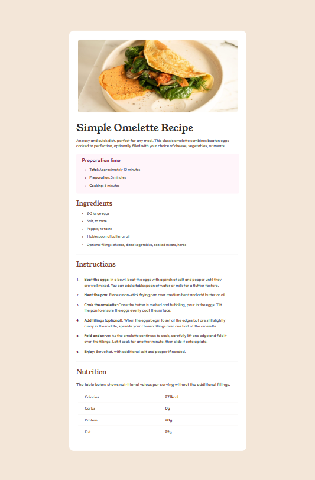
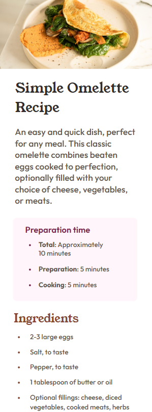

# Frontend Mentor - Recipe Page Solution

This is a solution to the [Recipe Page Challenge on Frontend Mentor](https://www.frontendmentor.io/challenges/recipe-page-KiTsR8QQKm). Frontend Mentor challenges help you improve your coding skills by building realistic projects.

---

## Table of Contents

- [Overview](#overview)
  - [The Challenge](#the-challenge)
  - [Screenshot](#screenshot)
  - [Links](#links)
- [My Process](#my-process)
  - [Built With](#built-with)
  - [What I Learned](#what-i-learned)
  - [Continued Development](#continued-development)
  - [Useful Resources](#useful-resources)
- [Author](#author)
- [Acknowledgments](#acknowledgments)

---

## Overview

### The Challenge

The challenge was to create a **responsive recipe page** that adapts well from mobile to large screen sizes.  

One of the key challenges I faced was maintaining **readability on large resolutions**, as the card layout tends to become long. I had to make sure the elements remained visually balanced and easy to read across all screen sizes.

### Screenshot




### Links
  
- **Live Site URL:** [https://cedric-celestino.github.io/recipe-page/](https://cedric-celestino.github.io/recipe-page/)

---

## My Process

I followed a **mobile-first workflow**, starting with small screens and then scaling up to larger resolutions.  
I focused on using semantic HTML and CSS techniques that make the layout clean and easy to maintain.

### Built With

- Semantic HTML5 markup  
- CSS custom properties  
- Flexbox  
- Mobile-first workflow  

---

### What I Learned

I improved my understanding of **responsive layouts** and how to make long content more readable by adjusting padding, margins, and max-widths.  

Here’s one of my favorite code snippets from this project:

```css

.card {
  max-width: 50rem;
  width: 100%;
  border-radius: 1.3em;
  margin: auto auto;
  padding: 2rem;
}


### Continued Development

In future projects, I want to focus more on:

- Using **CSS Grid** for more complex layouts  
- Improving **typography scaling** for large displays  
- Exploring **clamp()** for responsive font sizing  

---

### Useful Resources

- [freeCodeCamp](https://www.freecodecamp.org) – Helped me strengthen my understanding of Flexbox and responsive design techniques.  

---

## Author

- **Website** – [Cedric Celestino](https://github.com/Cedric-Celestino)  
- **Frontend Mentor** – [@Cedric-Celestino](https://www.frontendmentor.io/profile/Cedric-Celestino)  
- **Twitter** – [@yourusername](https://www.twitter.com/yourusername)

---

## Acknowledgments

Special thanks to **Frontend Mentor** for providing this project and to the **freeCodeCamp** community for offering excellent tutorials and examples on responsive design.
